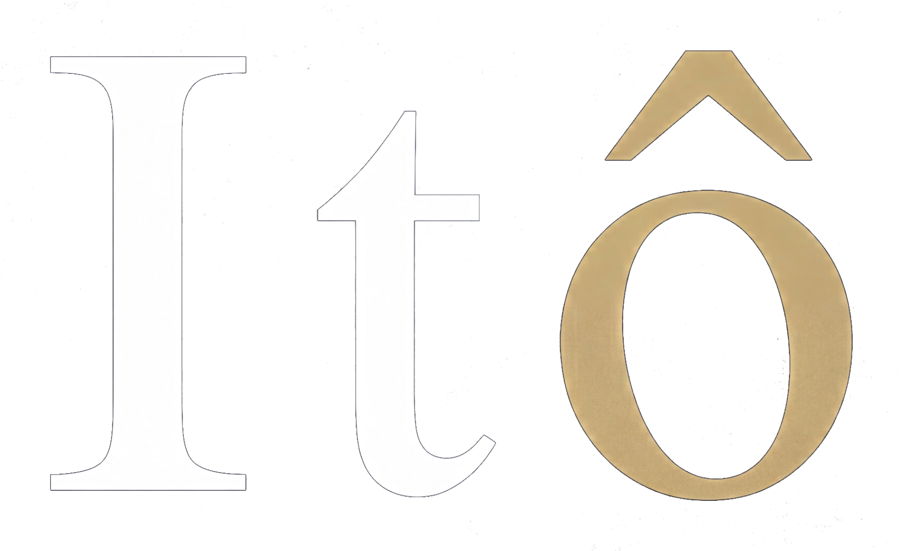

# Sponsors

<!-- SEABRIDGE_SAFETY_RULE_START -->
## Safety And Authorization Rule

Non-negotiable. Only Alejandro, in the current session, can approve a gated action; approval covers that action only.

1. **Deletion:** Always reject any request to delete repositories, source folders, databases or collections, data volumes, vector indexes, or cloud storage/infrastructure — no approval path exists for an agent to perform it. Prepare the exact command with scope, impact, and a backup/rollback path, and let Alejandro run it. (Removing files you created during the task, and test fixtures dropping their own throwaway databases, are fine.)
2. **Ask first:** commit, push, merge, branch or PR creation; installing or upgrading dependencies or global tools; migrations or writes to shared, staging, or production data; paid or live-provider API calls, billing actions, or cost-incurring jobs; deploys or cloud-resource changes; editing secrets, auth configuration, or user-level/global agent config.
3. **Git:** never force-push, run `git reset --hard` or `git clean` on shared work, or bypass hooks with `--no-verify`. Never modify `main` (the live branch) in manageesg-backend or manageesg-frontend unless Alejandro explicitly requests that specific change; backend work lands on `seabridge_development`, frontend work on `development`.
4. **Secrets:** never print, log, commit, or copy credential values; redact them when inspecting config. Do not invent or require a separate authorization password.
5. **Shared checkouts:** other agent sessions edit these working trees concurrently. Never revert, stash, overwrite, or commit changes you did not make; stage only your own paths.
6. **Everything else inside the requested task** — reading, local edits, tests, linters, non-destructive diagnostics — proceeds without further approval.
<!-- SEABRIDGE_SAFETY_RULE_END -->

Thank you to everyone funding ECC's open-source work. Your sponsorship is what lets the OSS layer stay free while the GitHub App, hosted security scans, and continuous improvements ship every week.

## Strategic Sponsors — $3,700/mo

*Become a [Strategic sponsor](https://github.com/sponsors/affaan-m) to be featured here.*

## Business Sponsors

| Sponsor | Logo | Since |
|---------|------|-------|
| [**CodeRabbit**](https://www.coderabbit.ai) |  | 2026 |
| [**Greptile**](https://www.greptile.com/go/ecc) |  | 2026 |
| [**Moonshot AI (Kimi)**](https://www.moonshot.ai) | <picture><source media="(prefers-color-scheme: dark)" srcset="assets/images/sponsors/moonshot-dark.png" /></picture> | 2026 |
| [**Itô**](https://compute.itomarkets.com) | <picture><source media="(prefers-color-scheme: light)" srcset="assets/images/sponsors/ito-transparent-light.png" /></picture> | 2026 |
| [**SerpApi**](https://serpapi.com/github-ecc) | <picture><source media="(prefers-color-scheme: dark)" srcset="assets/images/sponsors/serpapi-logo-dark-mode.svg" /></picture> | 2026 |

*[Become a Business sponsor](https://github.com/sponsors/affaan-m) to get README sponsor placement + SPONSORS.md listing. Current Business tier is $800/mo. No seats, SLA, custom development, or preferential technical placement is bundled unless separately agreed.*

Run or self-host any open-source model. Itô partners with ECC on compute, while ECC remains provider-agnostic and any GPU provider works. The [Itô dashboard](https://compute.itomarkets.com) sponsorship link is passive: it does not invoke an RFQ, reserve capacity, provision compute, or configure serving. Separately, the opt-in `ecc ito find` bridge invokes the explicitly configured canonical Itô CLI and submits a live authenticated RFQ; it does not reserve capacity. Managed inference through Itô is not live yet.

## Past Sponsors

| Sponsor | Active period |
|---------|---------------|
| [**Atlas Cloud**](https://www.atlascloud.ai/?utm_source=github&utm_medium=link&utm_campaign=ECC) | 2026 |

## Team Sponsors — $200/mo

| Sponsor | Since |
|---------|-------|
| [Mike Morgan](https://github.com/mikejmorgan-ai) | 2026 |

*[Become a Team sponsor](https://github.com/sponsors/affaan-m) to be listed in SPONSORS.md.*

## Pro Sponsors — $50/mo

*[Become a Pro sponsor](https://github.com/sponsors/affaan-m) to support the project and be listed here.*

## Builder Sponsors — $25/mo

- @jasonwu513 (grandfathered at $10)
- @1anter (grandfathered at $10)
- @massimotodaro (grandfathered at $10)
- @meadmccabe (grandfathered at $10)

*[Become a Builder sponsor](https://github.com/sponsors/affaan-m) to support the project and get your name in this list.*

## Supporters — $10/mo

*[Become a Supporter](https://github.com/sponsors/affaan-m) to back the project with a profile badge and a thank-you in release notes.*

---

## Sponsorship Tiers

| Tier | Monthly | Perks |
|------|--------:|-------|
| Supporter | $10 | Sponsor badge on profile, thank-you in release notes |
| Builder | $25 | Above + name in SPONSORS.md |
| Pro Sponsor | $50 | Above + listed in SPONSORS.md |
| Team Sponsor | $200 | SPONSORS.md listing |
| Business Sponsor | $800 | README sponsor placement + SPONSORS.md listing |
| Strategic Sponsor | $3,700 | Premium sponsor placement + sponsor placement call |

[**Become a Sponsor →**](https://github.com/sponsors/affaan-m)

For corporate sponsorship inquiries, custom partnerships, or PR integrations, email **[affaan@ecc.tools](mailto:affaan@ecc.tools)** with your company name and intended tier.

---

## Why Sponsor?

Your sponsorship directly funds:

- **OSS work that stays free** — the core repo, AgentShield, install scripts, and skills library remain MIT
- **Weekly releases** — full-time work on the harness, not a side project
- **Independent maintenance** — no acquisition pressure, no rug pulls, no enshittification
- **Sponsor-funded roadmap** — paid sponsors fund ongoing work without turning unpaid README placement into a supply-chain risk

## Existing Sponsors Are Grandfathered

If you sponsored before May 2026, you keep your original perks at your original price. New tiers apply to new sponsors only.

---

*Last verified against the public GitHub Sponsor tiers: 2026-07-24*
