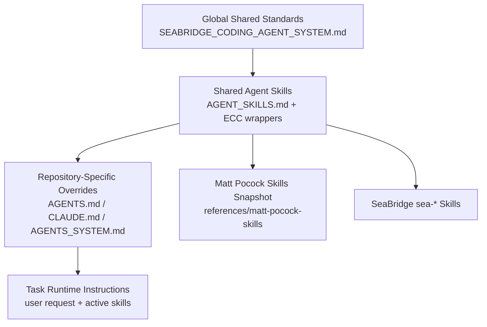

# Matt Pocock Skills Integration For SeaBridgeAI

Date: 2026-05-11

SYSTEM_ID: SEABRIDGE_AGENT_SYSTEM_V1

## Summary

SeaBridgeAI now uses `mattpocock/skills` as a centralized engineering-skills
reference, adapted through ECC wrappers. The integration extends the existing
SeaBridgeAI agent ecosystem; it does not replace `sea-*` skills, Superpowers,
GSD, Agent Shield, Graphify, FalkorDB, or repo-specific instructions.

ECC-vendored upstream snapshot:
`C:\Users\adelm\SeaBridgeAI\everything-claude-code\references\matt-pocock-skills`

ECC shared contract:
`C:\Users\adelm\SeaBridgeAI\everything-claude-code\AGENT_SKILLS.md`

Machine registry:
`C:\Users\adelm\SeaBridgeAI\everything-claude-code\manifests\agent-skills\matt-pocock-skills.json`

## Architecture



No circular loading is required: product repos point to ECC; ECC wrappers point
to the vendored ECC reference snapshot; upstream skill bodies do not point back into
product repos.

## Active Invocation

Supported forms:

```text
#skill/grill-me
#skill/ubiquitous-language
#skill/improve-codebase-architecture

Use skill: grill-me
Use skill: ubiquitous-language
Use skill: improve-codebase-architecture
```

Agents should name active skills during planning and load only the smallest
matching wrapper.

## Immediate Skill Mapping

| Skill | Upstream path | SeaBridge wrapper | Internal overlap | Compatibility strategy |
|---|---|---|---|---|
| `grill-me` | `skills/productivity/grill-me/SKILL.md` | `.agents/skills/grill-me/SKILL.md` | `sea-brainstorming-and-spec-refinement`, `sea-senior-dev-workflow` | Use as adversarial clarification lens before edits. |
| `ubiquitous-language` | `skills/deprecated/ubiquitous-language/SKILL.md` | `.agents/skills/ubiquitous-language/SKILL.md` | `sea-sustainability-domain-review`, `sea-ai-data-integrity`, docs conventions | Adapt only; write to existing repo glossary locations. |
| `improve-codebase-architecture` | `skills/engineering/improve-codebase-architecture/SKILL.md` | `.agents/skills/improve-codebase-architecture/SKILL.md` | `sea-senior-dev-workflow`, `sea-test-driven-development`, review policy | Use for candidate discovery and behavior-preserving refactors. |

## Full Inventory Classification

| Skill | Categories | SeaBridge status |
|---|---|---|
| `design-an-interface` | API design, Architecture | Deprecated upstream; map into architecture wrapper when useful. |
| `qa` | Testing, Developer workflow | Deprecated upstream; prefer SeaBridge verification and E2E skills. |
| `request-refactor-plan` | Refactoring, Developer workflow | Deprecated upstream; prefer SeaBridge orchestration and architecture wrapper. |
| `ubiquitous-language` | Documentation, Architecture, API design | Active adapted wrapper. |
| `diagnose` | Debugging, Performance | Map to `sea-systematic-debugging`. |
| `grill-with-docs` | Architecture, Documentation, Product thinking | Map to `grill-me` plus `ubiquitous-language`. |
| `improve-codebase-architecture` | Architecture, Refactoring, Testing, Backend reliability, Frontend UX | Active wrapper. |
| `prototype` | Product thinking, Frontend UX, Developer workflow | Use only for explicit prototype work. |
| `setup-matt-pocock-skills` | Agent orchestration, Developer workflow | Reference only; SeaBridge has its own setup. |
| `tdd` | Testing, Refactoring | Map to `sea-test-driven-development`. |
| `to-issues` | Release engineering, Developer workflow | Use only when asked to create tickets/issues. |
| `to-prd` | Product thinking, Documentation | Use only when asked for PRD generation. |
| `triage` | Developer workflow, Release engineering | Use only for issue triage workflows. |
| `zoom-out` | Architecture, Documentation | Use for codebase orientation. |
| `review` | Testing, Security, Developer workflow | Upstream in-progress; prefer SeaBridge review policy. |
| `writing-beats` | Documentation | Reference only. |
| `writing-fragments` | Documentation | Reference only. |
| `writing-shape` | Documentation | Reference only. |
| `git-guardrails-claude-code` | Security, Developer workflow | Reference only; no hooks without approval. |
| `migrate-to-shoehorn` | Testing, Refactoring | Not adopted by default. |
| `scaffold-exercises` | Developer workflow, Documentation | Reference only. |
| `setup-pre-commit` | Release engineering, Developer workflow | Requires explicit approval for hooks/dependencies. |
| `edit-article` | Documentation | Reference only. |
| `obsidian-vault` | Documentation, Developer workflow | Prefer `sea-knowledge-vault`. |
| `caveman` | Developer workflow | Already present in Codex/user skill layer. |
| `grill-me` | Product thinking, Architecture, Developer workflow | Active wrapper. |
| `handoff` | Developer workflow, Documentation | Map to `sea-cross-repo-handoff` and `sea-context-hygiene`. |
| `write-a-skill` | Agent orchestration, Developer workflow | Map to `sea-skill-creator-protocol`. |

## Conflict Analysis

| Area | Existing SeaBridge behavior | Upstream behavior | Resolution |
|---|---|---|---|
| Skill setup | ECC owns central skills and repo pointers. | Upstream has `setup-matt-pocock-skills`. | Do not run upstream setup as a separate framework. Use ECC wrappers. |
| Ubiquitous language output | Repo docs and domain reports already exist. | Upstream writes `UBIQUITOUS_LANGUAGE.md` in working directory. | Prefer `docs/domain-language.md` or existing glossary path. |
| Git guardrails/hooks | SeaBridge approval gates and Agent Shield exist. | Upstream can install Claude hooks. | Reference only; no hook install without approval. |
| TDD | SeaBridge self-verification loop and TDD skill exist. | Upstream has `tdd`. | Map to `sea-test-driven-development`; use upstream as supplemental reference only. |
| Review | SeaBridge automated review collaboration exists. | Upstream `review` is in-progress. | Prefer SeaBridge review policy. |

No duplicate runtime hooks, global installs, or competing command systems were
introduced.

## Agent Compatibility Matrix

| Agent | Loading path | Skill invocation | Notes |
|---|---|---|---|
| Claude Code | `CLAUDE.md` -> ECC -> `AGENT_SKILLS.md` | `#skill/<name>` or read wrapper | No new global plugin required. |
| Codex CLI | `AGENTS.md` -> ECC -> `AGENT_SKILLS.md` | Read wrapper skill | No hooks; instruction-based. |
| Gemini Code Assist | `AGENTS.md` / Gemini config -> ECC | Read wrapper skill | Use same safety gates. |
| OpenCode/OpenClaw style agents | `AGENTS.md` and adapter config | Read wrapper skill | Preserve OpenClaw/OpenCode plugin conventions. |
| Cursor | `.cursor/rules` or repo docs -> ECC | Read wrapper skill | No separate rules required unless repo later opts in. |
| Copilot CLI | `AGENTS.md` -> ECC | Read wrapper skill | No MCP/subagent assumptions. |
| Future MCP-compatible agents | Manifest or repo docs -> ECC | Read wrapper skill | Registry JSON is the stable discovery surface. |

## Example Workflows

### Grill-Me Session

```text
User: #skill/grill-me Build a tenant export workflow.
Agent:
1. I need to verify tenant isolation and export scope before edits.
2. Recommended default: export only records owned by the current tenant,
   redact secrets, and write an integration test around cross-tenant denial.
3. Question: should exports include derived AI summaries, or only source data?
```

### Ubiquitous Language Output

```md
# Domain Language

## OpenSeaBri Insurance

| Term | Definition | Aliases to avoid |
|---|---|---|
| Property Profile | The user's canonical home record for risk and recommendations. | House, asset |
| Resilience Action | A recommended mitigation step tied to evidence and priority. | Task, todo |

## Relationships

- A **Property Profile** can have many **Resilience Actions**.
- A **Resilience Action** may cite one or more evidence sources.
```

### Architecture Refactor Output

```text
Candidate: Extract provider selection behind a typed interface.
Files: app/services/provider_router.py, app/services/report_generation.py
Problem: report generation knows provider ordering, fallback, logging, and retry.
Solution: move provider choice into a small interface with two adapters.
Verification: existing report tests plus new fallback regression test.
Risk: provider behavior drift; rollback by retaining old function path behind flag.
```

### Multi-Skill Composition

```text
#skill/grill-me
#skill/improve-codebase-architecture
#skill/ubiquitous-language
```

Order:

1. Clarify requirements and risks.
2. Align domain language.
3. Propose architecture candidates.
4. Implement only the selected candidate with tests.
5. Run SeaBridge verification loop.

## Update Mechanism

Check current ECC snapshot:

```powershell
powershell -ExecutionPolicy Bypass -File C:\Users\adelm\SeaBridgeAI\everything-claude-code\scripts\update-canonical-skills.ps1
```

Upstream pulls are intentionally disabled for this snapshot. Update through the
normal `everything-claude-code` review, test, commit, and push flow.

Validate integration:

```powershell
powershell -ExecutionPolicy Bypass -File C:\Users\adelm\SeaBridgeAI\everything-claude-code\scripts\check-canonical-skills.ps1
```

## Rollback

1. Stop using `#skill/grill-me`, `#skill/ubiquitous-language`, and
   `#skill/improve-codebase-architecture`.
2. Remove repo-level `AGENT_SKILLS.md` and `AGENT.md` pointer files if needed.
3. Remove ECC wrappers for the three skills.
4. Keep or remove the vendored reference snapshot only after confirming no other agents use it.

Do not delete the vendored reference snapshot automatically.
